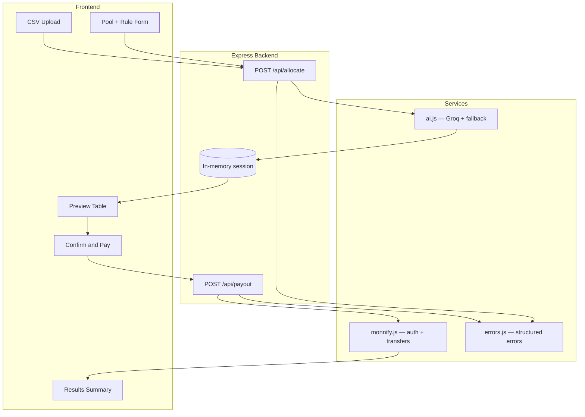

<div align="center">

# AutoPay

**AI-powered payout engine — turns a plain allocation rule and a scored participant list into a reviewed, human-approved payout, executed via Monnify.**

[](https://nodejs.org/)
[](https://expressjs.com/)
[](https://developers.monnify.com/)
[](https://console.groq.com/)
[](LICENSE)
[](https://apiconf.net/)

*Built for the Monnify API Conf Developer Challenge — CTF prize pool track*

[Features](#-what-it-does) • [Architecture](#-architecture) • [Setup](#-setup) • [Demo Flow](#-demo-flow) • [Error Handling](#-error-handling) • [Safety](#-safety-design)

</div>

---

## Overview

AutoPay adds an **AI allocation layer** on top of a real disbursement API. Existing payout tools automate *sending* money — AutoPay also helps decide *how much each person gets*, with a **human confirmation step** before any transfer is triggered.

> **Tagline:** AI proposes → human confirms → server validates → Monnify pays.

---

## What it does

| Step | Action |
|:--:|--------|
| 1 | Admin sets a **total pool amount** and picks an allocation rule |
| 2 | Participant scores are uploaded via **CSV** (exported from a Google Form) |
| 3 | **Groq (Llama 3.3)** parses the rule against the participant list and proposes a payout breakdown |
| 4 | The proposal is **validated server-side** before anyone sees it |
| 5 | Admin reviews the preview table and clicks **Confirm & Pay** — nothing is disbursed before this |
| 6 | Backend calls the **Monnify sandbox API** to transfer funds to each participant |
| 7 | A per-person payout summary is shown at the end |

---

## Why this exists

Corporate bonus pools, hackathon prize pools, and CTF leaderboards all share the same problem: **turning a rule + a scored list into fair payouts**. AutoPay automates the decision layer while keeping a human in the loop and validating every amount before money moves.

<details>
<summary><strong>Example use case: CTF prize pool</strong></summary>

- Pool: **₦50,000**
- Rule: **Top 3 scorers — weighted by score**
- Input: CSV of participant names, scores, and bank details
- Output: AI-proposed split → admin review → Monnify disbursement

</details>

---

## Architecture



---

## Tech stack

| Layer | Technology |
|-------|------------|
| Backend | Node.js + Express |
| AI | Groq API (`llama-3.3-70b-versatile`) |
| Payments | Monnify Sandbox API (single transfers) |
| Frontend | Plain HTML / CSS / JS |
| Data input | CSV upload |
| Storage | None — in-memory session for demo |

---

## Project structure

```
autopay/
├── server.js              # Express app, routes, session state
├── monnify.js             # Monnify auth + sequential disbursements
├── ai.js                  # Groq call, JSON parsing, validation, fallback
├── errors.js              # Structured error codes + API responses
├── public/
│   ├── index.html         # 3-step UI: setup → preview → results
│   ├── style.css
│   └── app.js             # CSV parsing, fetch calls, error display
├── sample-participants.csv
├── .env.example
└── package.json
```

---

## Setup

### 1. Clone and install

```bash
git clone https://github.com/philipakintola01/autopay.git
cd autopay
npm install
```

### 2. Configure environment

Copy the example env file and add your keys:

```bash
cp .env.example .env
```

```env
MONNIFY_API_KEY=your_monnify_api_key
MONNIFY_SECRET_KEY=your_monnify_secret_key
MONNIFY_CONTRACT_CODE=your_contract_code
MONNIFY_SOURCE_ACCOUNT=your_wallet_account_number
GROQ_API_KEY=your_groq_api_key
PORT=3000
```

| Key | Where to get it |
|-----|-----------------|
| Monnify keys | [app.monnify.com](https://app.monnify.com) → Developers |
| Groq key | [console.groq.com](https://console.groq.com) |
| Wallet account | Monnify dashboard → Developer → Wallet Account Number |

### 3. Run

```bash
npm start
```

### 4. Test modules standalone

```bash
npm run test:monnify   # verify Monnify auth
npm run test:ai        # verify Groq allocation
```

---

## Demo flow

What we show on stage:

1. Upload a pre-loaded CSV of CTF participant scores
2. Select rule: **Top N weighted by score**
3. Show the **AI-generated preview table**
4. Click **Confirm & Pay**
5. Show Monnify sandbox transfers initiating (may show `PENDING_AUTHORIZATION` for OTP)
6. Show the final per-person payout summary

<details>
<summary><strong>CSV format</strong></summary>

```csv
name,score,accountNumber,bankCode
Ada Lovelace,95,0123456789,058
Grace Hopper,88,0987654321,044
Alan Turing,82,1122334455,011
```

</details>

---

## Error handling

AutoPay returns structured errors with codes the frontend can display clearly.

<details>
<summary><strong>Allocation errors</strong></summary>

| Code | Meaning | User-facing behavior |
|------|---------|----------------------|
| `VALIDATION_ERROR` | Bad pool, rule, or participant data | Toast with fix hint |
| `AI_UNAVAILABLE` | Groq API unreachable | Falls back to deterministic split |
| `AI_INVALID_OUTPUT` | Groq returned bad JSON | Falls back to deterministic split |
| `CONFIG_ERROR` | Missing `.env` keys | Server warning on startup |

</details>

<details>
<summary><strong>Payout errors</strong></summary>

| Code | Meaning | User-facing behavior |
|------|---------|----------------------|
| `PAYOUT_MISSING_BANK_DETAILS` | CSV missing account info | Blocks payout, lists names |
| `MONNIFY_AUTH_FAILED` | Bad Monnify credentials | Error toast |
| `MONNIFY_INSUFFICIENT_BALANCE` | Wallet too low | Per-recipient failure |
| `MONNIFY_INVALID_ACCOUNT` | Bad bank details | Per-recipient failure |
| `MONNIFY_PENDING_AUTHORIZATION` | Sandbox MFA / OTP required | Shown as pending, not failure |
| `MONNIFY_DISBURSEMENT_FAILED` | Transfer rejected | Per-recipient failure |

</details>

<details>
<summary><strong>Partial payout handling</strong></summary>

Batch pay is handled as **sequential single transfers** — one Monnify API call per recipient. If one fails, the rest still run. The results screen shows:

- Successful transfers
- Pending OTP authorizations
- Failed transfers with error messages

</details>

---

## Safety design

- The AI **never triggers a payment directly** — it only produces a proposal
- All amounts are **validated server-side** before preview or payout
- If Groq fails or returns invalid output, the system uses a **deterministic fallback split**
- A human must **explicitly confirm** before any Monnify transfer is made
- No database — session data lives in memory for the demo

---

## API endpoints

| Method | Route | Description |
|--------|-------|-------------|
| `GET` | `/health` | Service health + provider status |
| `GET` | `/api/rules` | Available allocation rule templates |
| `GET` | `/api/wallet` | Monnify sandbox wallet balance |
| `POST` | `/api/allocate` | Generate AI payout preview |
| `POST` | `/api/payout` | Execute confirmed disbursements |

---

## Team

| Name | Role |
|------|------|
| Akintola Philip | Monnify integration, backend, error handling |
| Samuel Akinpelu | AI logic, validation, frontend |

---

## Status


- Sandbox only — not production-ready
- Sequential single transfers (not Monnify bulk API)
- MFA/OTP may appear in sandbox as `PENDING_AUTHORIZATION`

---

<div align="center">

**#APIConfXMonnify** • **#DeveloperChallenge**

</div>
